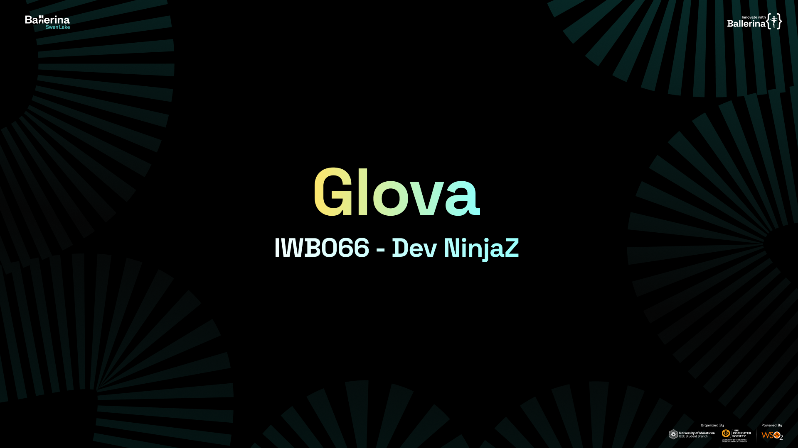

# Glova Mobile Application

 <!-- Replace with the path to your PNG image -->

## Project Description
**Glova Mobile Application** combines facial recognition and AI to deliver personalized skincare solutions. It analyzes an individual's skin type and conditions, providing customized routines and product recommendations tailored to their concerns and lifestyle. The app addresses the widespread issue of individuals struggling to find effective skincare products, often resulting in wasted money and frustration. By leveraging advanced technology, Glova simplifies skincare by offering targeted, data-driven solutions for users dealing with concerns like acne, eczema, and psoriasis, improving both skin health and user satisfaction.

## Team Information
We are **Team Dev NinjaZ**.

## Problem Statement
Many individuals struggle to find the right skincare products and routines for their unique skin concerns, compounded by the prevalence of skin conditions like Acne, Eczema, and Psoriasis. This leads to frustration, wasted money, and often ineffective skincare practices. Glova leverages Ballerina’s advanced features to address this issue.

## How We Used Ballerina
We chose **Ballerina** for its strong integration capabilities with healthcare applications. Specifically, we utilized Ballerina for **FHIR-compliant API integration** and **efficient data handling**. With Ballerina, we could easily manage complex healthcare data formats (such as JSON, XML, and FHIR resources), while ensuring our app remains scalable and cloud-ready. Additionally, we used Ballerina to handle **authentication** and perform **CRUD operations** for user data. Ballerina’s robust error handling and strong type system contributed to making our solution reliable and efficient, which is critical when dealing with sensitive healthcare data.

## Why Ballerina?
In the healthcare sector, accurate data management is essential. By combining Ballerina with FHIR standards, we are able to exchange and process healthcare data securely and efficiently. Ballerina’s ability to seamlessly manage different data formats, coupled with its microservices-friendly architecture, made it the perfect choice for building Glova. It ensures the app is scalable, reliable, and compliant with healthcare data standards.

## Source Code
[GitHub Repository](https://github.com/HeshanNavindu-7/iwb066-dev-ninjaz.git)

## Presentation
[Google Drive Presentation](https://drive.google.com/drive/folders/11IQvDLA8uWQiLkwpIOd6Mc5xN8nZhMyK?usp=sharing)

## YouTube Video
[Watch our Demo on YouTube](https://youtu.be/tc_DDNoQwBA)

---

#InnovateWithBallerina #Ballerinalang #WSO2 #IEEESBUOM #IEEECSUOM #TERM23/24 #Ballerina #BallerinaProgramming #HealthcareTech #AIinSkincare #CloudNative #APISecurity
